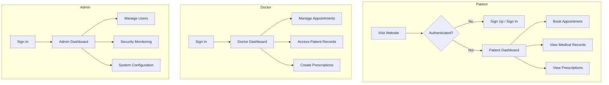
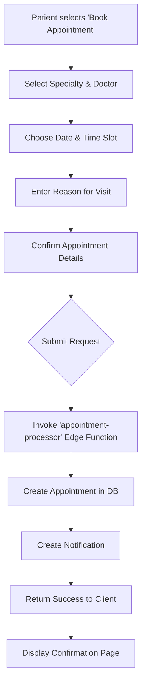
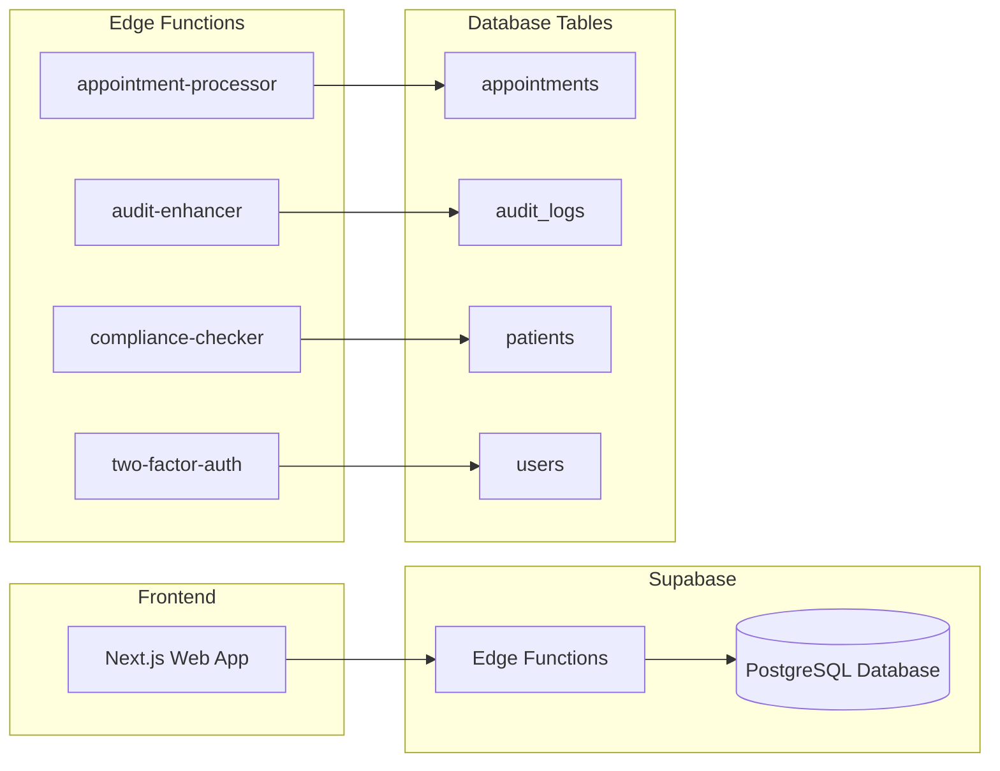
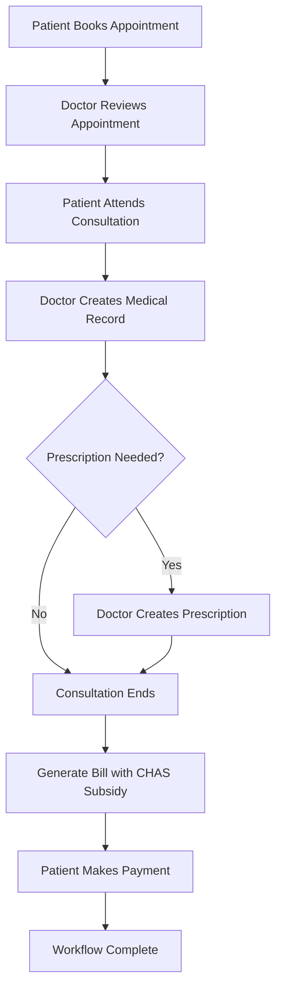
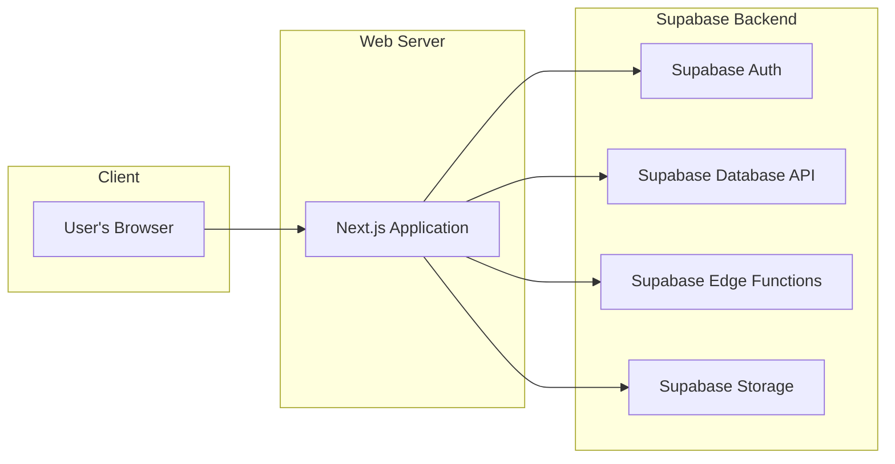
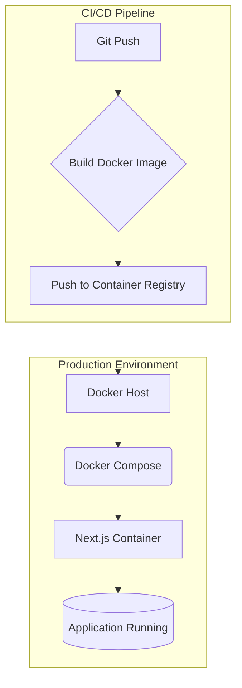

# Gabriel Family Clinic - Healthcare Platform Architecture

**Version:** 1.0  
**Date:** 2025-11-06  
**Author:** MiniMax Agent

## Table of Contents
1.  [Executive Summary](#1-executive-summary)
2.  [Introduction](#2-introduction)
    -   [2.1. Purpose](#21-purpose)
    -   [2.2. Scope](#22-scope)
    -   [2.3. Project Overview](#23-project-overview)
3.  [Application Architecture](#3-application-architecture)
    -   [3.1. Frontend Architecture](#31-frontend-architecture)
    -   [3.2. Backend Architecture](#32-backend-architecture)
    -   [3.3. Data Flow and State Management](#33-data-flow-and-state-management)
    -   [3.4. Security Architecture](#34-security-architecture)
4.  [Database Architecture](#4-database-architecture)
    -   [4.1. Database Schema](#41-database-schema)
    -   [4.2. Table Relationships](#42-table-relationships)
5.  [Deployment and Infrastructure](#5-deployment-and-infrastructure)
    -   [5.1. Dockerized Environment](#51-dockerized-environment)
    -   [5.2. Deployment Strategy](#52-deployment-strategy)
    -   [5.3. Environment Configuration](#53-environment-configuration)
6.  [Healthcare Compliance](#6-healthcare-compliance)
    -   [6.1. Singapore PDPA](#61-singapore-pdpa)
    -   [6.2. HIPAA Compliance Measures](#62-hipaa-compliance-measures)
    -   [6.3. CHAS Integration](#63-chas-integration)
7.  [File Hierarchy and Code Structure](#7-file-hierarchy-and-code-structure)
    -   [7.1. Project Structure Diagram](#71-project-structure-diagram)
    -   [7.2. Key File Descriptions](#72-key-file-descriptions)
8.  [Architectural Diagrams (Mermaid)](#8-architectural-diagrams-mermaid)
    -   [8.1. User Interaction Flow](#81-user-interaction-flow)
    -   [8.2. Application Logic Flow](#82-application-logic-flow)
    -   [8.3. Database Schema and Edge Functions](#83-database-schema-and-edge-functions)
    -   [8.4. Healthcare Workflow](#84-healthcare-workflow)
    -   [8.5. API Architecture](#85-api-architecture)
    -   [8.6. Deployment Architecture](#86-deployment-architecture)
9.  [Conclusion](#9-conclusion)

---

## 1. Executive Summary

The Gabriel Family Clinic Healthcare Platform is a modern, secure, and compliant web application designed to serve the needs of patients, doctors, and administrative staff in a Singapore-based healthcare context. The platform is built on a robust and scalable architecture, leveraging Next.js 14 for the frontend and Supabase for the backend, including database, authentication, and serverless edge functions.

The system is designed with a strong emphasis on security and compliance, incorporating features to meet Singapore's Personal Data Protection Act (PDPA) and ready for HIPAA, with specific integrations for the Community Health Assist Scheme (CHAS). The architecture is fully containerized using Docker, ensuring consistent and reliable deployments across different environments.

This document provides a comprehensive overview of the project's architecture, including the frontend and backend design, database schema, deployment strategy, and compliance measures. It also includes detailed diagrams and file structure analysis to serve as a guide for developers, architects, and stakeholders.

## 2. Introduction

### 2.1. Purpose

The purpose of this document is to provide a detailed architectural specification of the Gabriel Family Clinic Healthcare Platform. It is intended to be a technical guide for the development team and a reference for stakeholders to understand the system's design and capabilities.

### 2.2. Scope

This document covers the complete architecture of the Gabriel Family Clinic Healthcare Platform, including:
-   Frontend and backend application structure.
-   Database schema and relationships.
-   Deployment and infrastructure setup.
-   Security and compliance features.
-   Key components and their interactions.

### 2.3. Project Overview

The platform is a comprehensive healthcare solution with features for:
-   **Patients:** Appointment booking, viewing medical records, managing prescriptions, and making payments.
-   **Doctors:** Managing appointments, accessing patient records, and writing prescriptions.
-   **Admins:** User management, security monitoring, and system configuration.

The technology stack is centered around modern, open-source technologies chosen for their performance, scalability, and developer experience.

## 3. Application Architecture

### 3.1. Frontend Architecture

The frontend is a Next.js 14 application using the App Router, written in TypeScript. This choice provides a powerful framework for building a fast, SEO-friendly, and maintainable user interface.

-   **Framework:** Next.js 14
-   **Language:** TypeScript
-   **Styling:** Tailwind CSS with a custom design system for WCAG AAA accessibility.
-   **State Management:** React Hooks and Context API for managing local and global state.
-e   **Form Management:** React Hook Form with Zod for validation.
-   **UI Components:** A custom component library built with Radix UI primitives, ensuring accessibility and customizability.

### 3.2. Backend Architecture

The backend is powered by Supabase, a Backend-as-a-Service (BaaS) platform that provides a suite of tools for building applications quickly and securely.

-   **Database:** A PostgreSQL database with a custom schema designed for healthcare data.
-   **Authentication:** Supabase Auth for user authentication, including email/password, and two-factor authentication (2FA).
-   **Serverless Functions:** 16 Supabase Edge Functions written in Deno (TypeScript) handle business logic such as appointment processing, compliance checks, and notifications.
-   **Storage:** Supabase Storage for securely storing medical documents and other files.

### 3.3. Data Flow and State Management

The data flow is designed to be unidirectional and predictable.

1.  **Client-Side**: User interactions trigger events in the Next.js components.
2.  **API Layer**: The frontend communicates with the Supabase backend via the Supabase client library and direct calls to Edge Functions.
3.  **Backend Logic**: Edge Functions process requests, interact with the database, and return responses.
4.  **State Updates**: The frontend updates its state based on the responses from the backend, re-rendering the UI as necessary.

Global state, such as the authenticated user, is managed using React's Context API, while local component state is managed with `useState` and `useReducer` hooks.

### 3.4. Security Architecture

Security is a core consideration of the platform, with a multi-layered approach to protect sensitive patient data.

-   **Authentication:** Secure JWT-based authentication with 2FA.
-   **Authorization:** Role-based access control (RBAC) is implemented at both the application and database levels (using PostgreSQL RLS).
-   **Data-in-Transit:** All communication between the client and server is encrypted with SSL/TLS.
-   **Data-at-Rest:** Sensitive data is encrypted in the database.
-   **Edge Functions:** Each function has its own security and validation layer.
-   **Audit Trails:** A comprehensive audit logging system tracks all significant actions within the platform.
-   **Compliance:** The architecture includes specific features to address PDPA and HIPAA requirements.

---

## 4. Database Architecture

The database is a PostgreSQL instance managed by Supabase. The schema is designed to support the complex data requirements of a healthcare platform, with a focus on data integrity, security, and compliance.

### 4.1. Database Schema

The schema consists of 15 tables that store information about users, patients, doctors, appointments, medical records, and more. The complete schema is defined in the `supabase/migrations/001_initial_schema.sql` file.

Here is a summary of the key tables:

| Table Name | Description |
|---|---|
| `users` | Stores user authentication information, including email, password (hashed), and role (patient, doctor, admin). |
| `patients` | Contains patient demographic and medical information, including NRIC, date of birth, and CHAS card details. |
| `doctors` | Stores doctor profiles, including medical license, specialties, and consultation fees. |
| `appointments` | Manages appointment scheduling, including date, time, status, and reason for visit. |
| `medical_records` | Contains patient medical history, including diagnoses, treatments, and vital signs. |
| `prescriptions` | Manages medication prescriptions for patients. |
| `payments` | Tracks billing and payments, including CHAS subsidies and insurance claims. |
| `audit_logs` | Provides a comprehensive audit trail for all significant actions taken within the platform. |
| `security_incidents`| Logs and tracks security incidents |
| `compliance_checks`| Records the results of automated compliance checks |
| `chas_subsidies`| Stores information about CHAS subsidies |
| `notifications`| Manages system-generated notifications to users |
| `session_logs`| Logs user session activity |
| `user_sessions` | Tracks active user sessions |
| `system_config` | Stores system-wide configuration and settings |

### 4.2. Table Relationships

The tables are interconnected through foreign key relationships to ensure data consistency.

-   A `users` record can be associated with a `patients` record or a `doctors` record.
-   An `appointments` record links a `patients` record with a `doctors` record.
-   `medical_records` and `prescriptions` are linked to `patients`, `doctors`, and `appointments`.
-   `payments` are associated with `appointments` and `patients`.
-   `audit_logs` are linked to `users` to track actions.

This normalized structure minimizes data redundancy and ensures that relationships between entities are clearly defined.

---

## 5. Deployment and Infrastructure

The platform is designed for containerized deployment using Docker, ensuring consistency and portability across environments. The deployment architecture is automated and scalable.

### 5.1. Dockerized Environment

The application is containerized using a multi-stage `Dockerfile` that builds a lightweight production image based on `node:22-alpine`.

-   **Builder Stage:** Installs dependencies, compiles the Next.js application, and prepares the production build.
-   **Production Stage:** Copies the built application into a minimal Node.js environment, reducing the image size and attack surface.

The `docker-compose.yml` file orchestrates the production deployment, defining the frontend service, network configuration, and volume mounts for persistent data.

### 5.2. Deployment Strategy

The `deploy.sh` script automates the deployment process, including:
1.  Building the Docker image.
2.  Tagging the image with the current version.
3.  Pushing the image to a container registry.
4.  Deploying the new version to the production environment.

Alternative deployment platforms such as Vercel and Railway are also supported, with a `vercel.json` file provided for Vercel deployments.

### 5.3. Environment Configuration

Environment variables are managed through a `.env.docker` file, which serves as a template for production configuration. This file includes settings for:
-   Supabase credentials.
-   Healthcare-specific configurations (CHAS, PDPA).
-   Security and session management.
-   Email and notification services.

---

## 6. Healthcare Compliance

The platform is built with a strong focus on meeting the healthcare compliance requirements of Singapore.

### 6.1. Singapore PDPA

The platform adheres to Singapore's Personal Data Protection Act (PDPA) by implementing:
-   **Consent:** Mechanisms for obtaining and managing patient consent for data collection and use.
-   **Purpose Limitation:** Data is collected and used only for specified purposes.
-   **Data Minimization:** Only necessary patient data is collected.
-   **Security:** Robust security measures to protect personal data.
-   **Access and Correction:** Patients can access and correct their personal data.
-   **Retention Limitation:** Data is retained only for as long as necessary (e.g., 7 years for medical records).

The `compliance-checker` edge function automates the verification of PDPA compliance for data access and export operations.

### 6.2. HIPAA Compliance Measures

While the primary focus is on Singaporean regulations, the platform incorporates security measures that align with the Health Insurance Portability and Accountability Act (HIPAA):

-   **Access Control:** Role-based access control and unique user identification.
-   **Audit Controls:** Comprehensive audit trails for all actions involving protected health information (PHI).
-   **Data Encryption:** Encryption of data in transit and at rest.
-   **Security Incident Procedures:** A system for logging and responding to security incidents.

### 6.3. CHAS Integration

The platform is integrated with Singapore's Community Health Assist Scheme (CHAS).
-   The `lib/healthcare/chas-utils.ts` file contains utilities for calculating CHAS subsidies based on card type (Blue, Orange, Green).
-   The backend processes CHAS subsidies and applies them to patient bills.
-   The `chas-integration` edge function handles communication with the CHAS API.

---

## 7. File Hierarchy and Code Structure

### 7.1. Project Structure Diagram

The following diagram provides a high-level overview of the project's directory and file structure, highlighting the key areas of the codebase.

### 7.2. Key File Descriptions

| File Path | Description |
|---|---|
| `app/layout.tsx` | The root layout of the application, defining the main HTML structure and including global styles and metadata. |
| `app/page.tsx` | The homepage of the application, serving as the main entry point for users. |
| `lib/supabase/client.ts` | Configures and exports the Supabase client for interacting with the backend. |
| `lib/supabase/auth.ts` | Contains authentication-related utility functions, such as sign-in, sign-up, and user session management. |
| `lib/healthcare/chas-utils.ts`| Provides utility functions for calculating CHAS subsidies and other healthcare-related logic. |
| `lib/singapore/localization.ts`| Includes functions for Singapore-specific formatting and validation (NRIC, phone numbers, etc.). |
| `supabase/functions/...` | Each directory contains a serverless edge function responsible for a specific piece of business logic. |
| `supabase/migrations/...` | Contains the SQL migration files that define the database schema. |
| `Dockerfile` | Defines the multi-stage Docker build process for creating a production-ready container image. |
| `docker-compose.yml` | Orchestrates the deployment of the application and its services in a Docker environment. |

---

## 8. Architectural Diagrams (Mermaid)

### 8.1. User Interaction Flow

This diagram illustrates the primary interaction paths for the different user roles on the platform.

### 8.2. Application Logic Flow (Appointment Booking)

This diagram shows the step-by-step logic of the appointment booking process.

### 8.3. Database Schema and Edge Functions

This diagram provides a high-level view of the relationship between the database tables and the Supabase Edge Functions.

### 8.4. Healthcare Workflow (Patient Consultation)

This diagram illustrates the end-to-end workflow of a patient consultation.

### 8.5. API Architecture

This diagram shows the API architecture, with the Next.js frontend interacting with Supabase services.

### 8.6. Deployment Architecture

This diagram illustrates the Docker-based deployment architecture.

```mermaid
graph TD
    A[gabriel-family-clinic] --> B(app)
    A --> C(components)
    A --> D(design-system)
    A --> E(lib)
    A --> F(public)
    A --> G(supabase)
    A --> H(tests)

    B --> B1(layout.tsx)
    B --> B2(page.tsx)
    B --> B3(globals.css)
    B --> B4(api)
    B --> B5(auth)
    B --> B6(patient)
    B --> B7(doctor)
    B --> B8(admin)

    B4 --> B4_1(appointments)
    B4 --> B4_2(patients)
    B4 --> B4_3(medical-records)

    B5 --> B5_1(signin)
    B5 --> B5_2(signup)
    B5 --> B5_3(setup-2fa)

    B6 --> B6_1(appointments)
    B6 --> B6_2(records)
    B6 --> B6_3(prescriptions)

    C --> C1(data)
    C --> C2(feedback)
    C --> C3(forms)
    C --> C4(ui)

    C1 --> C1_1(card.tsx)
    C2 --> C2_1(alert.tsx)
    C3 --> C3_1(input.tsx)
    C3 --> C3_2(select.tsx)
    C4 --> C4_1(button.tsx)

    D --> D1(tokens)
    D --> D2(themes)

    D1 --> D1_1(colors.ts)
    D1 --> D1_2(typography.ts)

    E --> E1(supabase)
    E --> E2(healthcare)
    E --> E3(singapore)
    E --> E4(seo)

    E1 --> E1_1(client.ts)
    E1 --> E1_2(auth.ts)
    E2 --> E2_1(chas-utils.ts)
    E3 --> E3_1(localization.ts)
    E4 --> E4_1(sitemap.ts)

    G --> G1(functions)
    G --> G2(migrations)

    G1 --> G1_1(appointment-processor)
    G1 --> G1_2(audit-enhancer)
    G1 --> G1_3(compliance-checker)
    G1 --> G1_4(two-factor-auth)

    G2 --> G2_1(001_initial_schema.sql)

    H --> H1(e2e)
    H --> H2(components)
```

---

## 9. Conclusion

The Gabriel Family Clinic Healthcare Platform is built on a modern, robust, and secure architecture that is well-suited to the demands of a healthcare environment in Singapore. The combination of Next.js 14 and Supabase provides a powerful and scalable foundation, while the focus on containerization with Docker ensures reliable and consistent deployments.

By integrating compliance with PDPA and HIPAA principles directly into the architecture, the platform prioritizes the security and privacy of patient data. The inclusion of CHAS integration and Singapore-specific localization further tailors the platform to the local context.

This document has provided a comprehensive overview of the system's architecture, from the frontend components to the backend services and database schema. The detailed diagrams and file descriptions serve as a valuable resource for the development team and stakeholders, ensuring a clear understanding of the platform's design and capabilities. The resulting platform is a high-quality, production-ready application that meets the complex needs of a modern healthcare practice.
