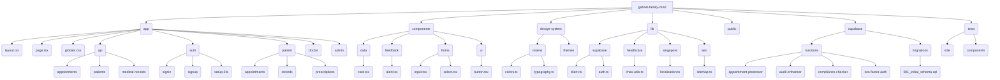

```mermaid
graph TD
    A[gabriel-family-clinic] --> B(app)
    A --> C(components)
    A --> D(design-system)
    A --> E(lib)
    A --> F(public)
    A --> G(supabase)
    A --> H(tests)

    B --> B1(layout.tsx)
    B --> B2(page.tsx)
    B --> B3(globals.css)
    B --> B4(api)
    B --> B5(auth)
    B --> B6(patient)
    B --> B7(doctor)
    B --> B8(admin)

    B4 --> B4_1(appointments)
    B4 --> B4_2(patients)
    B4 --> B4_3(medical-records)

    B5 --> B5_1(signin)
    B5 --> B5_2(signup)
    B5 --> B5_3(setup-2fa)

    B6 --> B6_1(appointments)
    B6 --> B6_2(records)
    B6 --> B6_3(prescriptions)

    C --> C1(data)
    C --> C2(feedback)
    C --> C3(forms)
    C --> C4(ui)

    C1 --> C1_1(card.tsx)
    C2 --> C2_1(alert.tsx)
    C3 --> C3_1(input.tsx)
    C3 --> C3_2(select.tsx)
    C4 --> C4_1(button.tsx)

    D --> D1(tokens)
    D --> D2(themes)

    D1 --> D1_1(colors.ts)
    D1 --> D1_2(typography.ts)

    E --> E1(supabase)
    E --> E2(healthcare)
    E --> E3(singapore)
    E --> E4(seo)

    E1 --> E1_1(client.ts)
    E1 --> E1_2(auth.ts)
    E2 --> E2_1(chas-utils.ts)
    E3 --> E3_1(localization.ts)
    E4 --> E4_1(sitemap.ts)

    G --> G1(functions)
    G --> G2(migrations)

    G1 --> G1_1(appointment-processor)
    G1 --> G1_2(audit-enhancer)
    G1 --> G1_3(compliance-checker)
    G1 --> G1_4(two-factor-auth)

    G2 --> G2_1(001_initial_schema.sql)

    H --> H1(e2e)
    H --> H2(components)
```